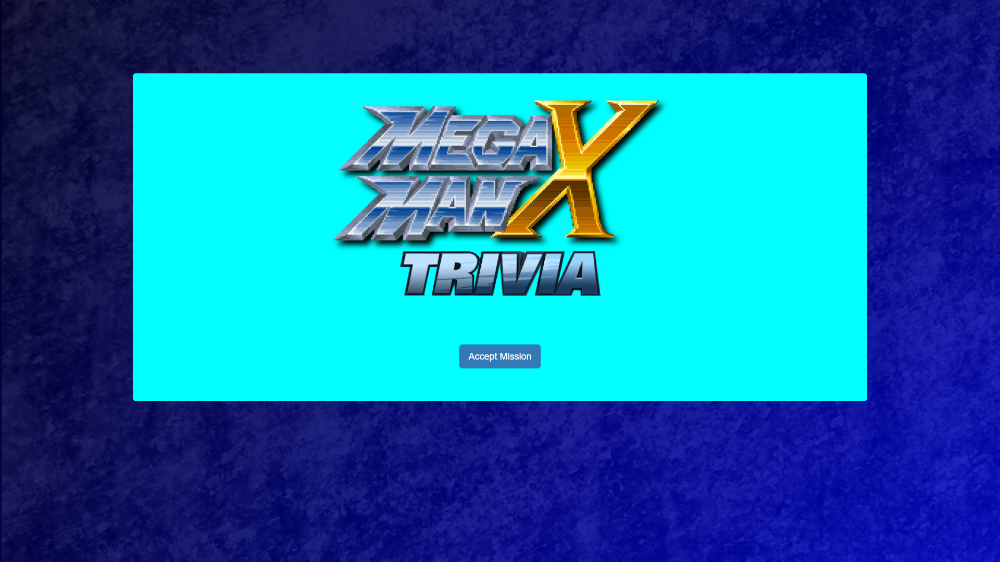
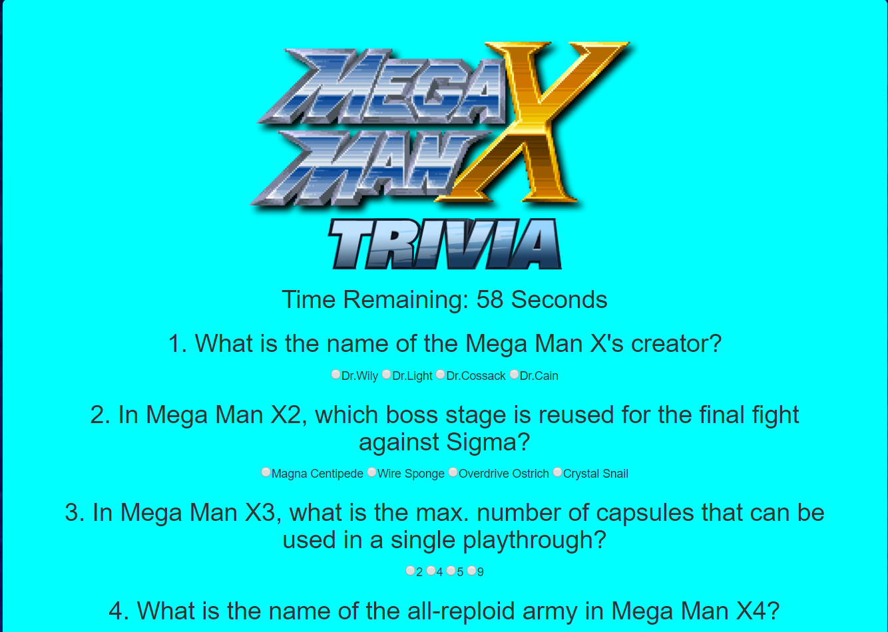
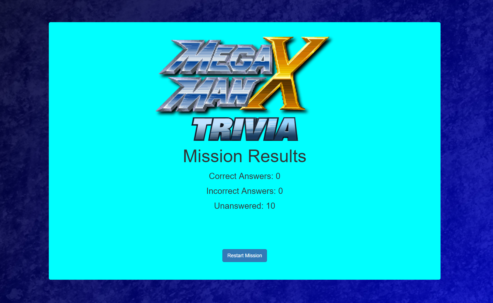

# Trivia Game
Week 5 Assignment: Trivia Game

## Mega Man X Trivia

This is an assignment that was given during the fifth week of University of Miami Coding bootcamp. This particular trivia game is the easier variant of two versions we could have done. All the questions appear upon hitting the "Mission Start" button.

## Purpose

The purpose of this was to learn how to implement timers into JavaScript. For the most part, I was successful, but I failed to get clearInterval() to take work properly, so I had to find a work around. 

## Links

To play the game immediately: https://virtualvasquez.github.io/TriviaGame/#
To see my portfolio (still in progress):https://virtualvasquez.github.io/Basic-Portfolio/portfolio.html 

## Screenshots

How the HTML looks upon loading

Upper half of the questions displayed once the "Accept Mission" button is pressed.

Once time is up or "End Mission" button is pressed, this screen appears.

