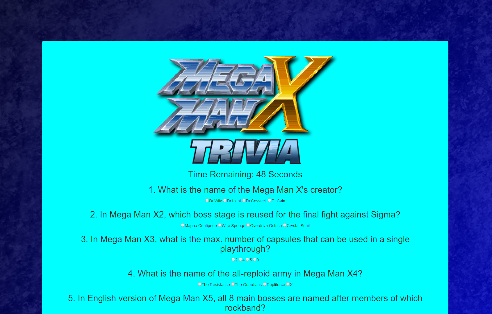

# Mega Trivia X

How well do you know the Mega Man X series?  

## Motivation

The purpose of this was to learn how to implement timed events with javascript/jQuery, as well as DOM manipulation. These actions are some of the fundamental asepcts of nearly all web applications, DOM manipulation more so than timed events. Though it is not _always_ necessary to have DOM manipulation in a web application, any self-respecting web developer should at least know how to implement it in some shape or form. 

## Links

To play the game immediately: https://virtualvasquez.github.io/TriviaGame/#

## Screenshots

How the HTML looks upon loading

Upper half of the questions displayed once the "Accept Mission" button is pressed.

Once time is up or "End Mission" button is pressed, this screen appears. The restart button will take you straight to the quiz, not the start screen. 

## Technologies Used

* HTML
* CSS
* Bootstrap
* Javascript
* jQuery
